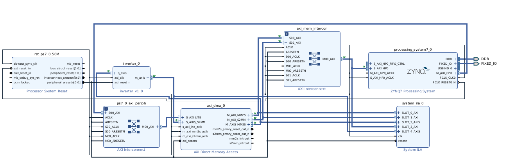
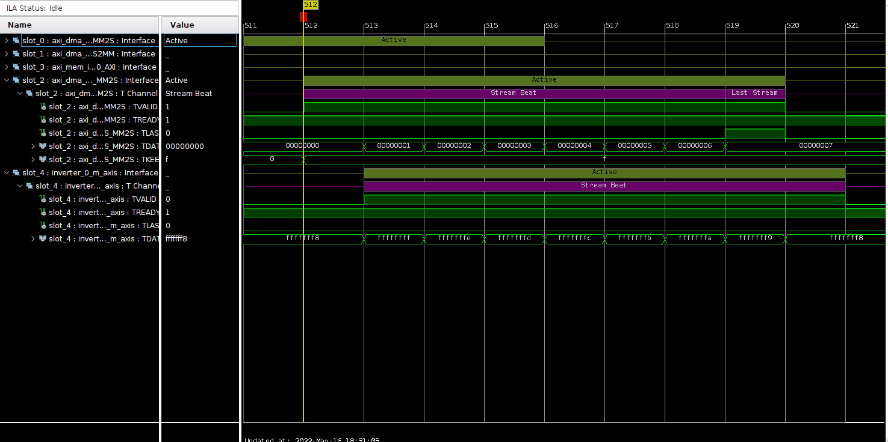

Lab Report should be in this README file
 # Lab8 

## part1 
-----
Part1 of Lab8 we created a custom AXI Stream inverting IP using Verilog code. Which inverts a 32 bit data input. 

Fig 8.1

Shown in figure 8.1 we have the AXI Stream blcok desing concept. The write chennnel consits of 4 signals. TVALID is an output signal from the masters interface and input to the Slave interface.The master inteface will first bring TVALID signal high when it has data to send to slave. Then master interface will put the data that it wants to send on the bus. In the end the Master interface will bring TLAST signal up indicating that it is the end of the data that it will send to the Slave interface. The slave interface on the other hand will bring the TREADY signal high indicating that it is ready to recive the data from the Master interface. 

Fig 8.2

Figure 8.2 shows the input and outputs ports created in verilog code for the Master and SLave interfaces. 

Fig 8.3

Figure 8.3 shows the functionlity of the AXI Stream Block form Fig 8.1 whithout the TLAST signal. We didnt inlsude the TLAST signal in our design. In the always block we are getting each byte of the 32 bit data and are subtracting 255 from it. SInce we want to invert the image entiely we know that the highest value in the ASCII for colors is 255. ANd inorder to invert the input data we need to subtract form 255 vlaue. Master interface will have the inverted data as shown in Fig 8.3 m_axis_data will recieve the inverted data. This is a dynamic code and could eb used with differnet input data prameters that are fdivisible by 8. With assign stament we are telling that whenver the master is ready to send data the slave will also be ready. ANd whenver slave interface is vlaid master interface will also be valid signal. 

After we finshed with the design of the AXI Stream we packeged the ip. Two important adjusments were made when we packegs the ip. We first fixed the port mapping of our master and slave interfaces, so that each interface will have their input and output ports on the block desing shown in FIgure 8.4. 

The second important adjustmant made to the design before packaging the ip was to connect both master and savle interfaces to the axi_clk. And gave 100MHz default clocking frecuncy to both master and slave interfaces. 
  

Fig 8.4

## Part2 
-------
## Vivado
--------
In part 2 of the lab we created a DMA system to use the IP to get data from user invert it and return it back. THis firmware design is hwosn in Figure 8.5. 

The Zynq porcessor communicated with the DMA though  AXI Lite portocol. THe DMAs memory to stream output will connec tto the inout of inverter ip. And the output of the inverter IP will go as an input to the DMAs Stream to memory input. We need ot change the PL default fabric clock value form 50MHz to 100Mhz so that it could connect with the inverter IP that that sits on the PL side of the board. Lastly, we enbaled the high performance port of the Zynq PS in order to have the DMA to connect  with the DDR. But in order for the DMA to have access to the DDR another AXI Lite protocol will be made for this communication. 
In the end we added debuging capabalites to our firmware design with he help of ILA Ip.We connected inverters output, DMAs both Stream interfaces and DMAs both DDR accessing ports with Intgrated Logic Analyzer. 
In the end, we created a wrapper genrated bithsrteam and exported the hardware as pre-sytnhesis. SInce the goal was to program the PL and PS speraltey. 

In the firmware the DMA has access to the entire DDR from 0x0000_0000 to 0x3FFF_FFFF 1G size of space. 

## Vits
--------
The DDR address on the PS is Ps7_addr_0 is (0x0010_0000 to 0x3FFF_FFFF). The processor has access to this region only. In the firmware the DMA has access to the entire DDR from 0x0000_0000 to 0x3FFF_FFFF 1G size of space. 
The DMA lives on the DDR with starting address of axi_dma_0(0x4040_0000 to 0x4040_FFFF). 

In the code we are sending 8 vlaues each 4 bytes. SO, in ttoal we are sending 32 bytes of data to the DMA. 
We use MM2S_DMASR(MM2S DMA status Register -offset0x4h) & S2Mm_DMASR(MM2S DMA status Register -offset0x4h). We use thisfunctions to read the status of the DMA before and after transfer to the inverter IP to see if the DMA is halted or not. 
In the end we program the device from PS and PL sepratley.

Fig 8.5 

In Figure 8.5 we see the inverted values output on the vitis terminal from the arrays input of values.The first value is 0 and the invert IP managed to invert the value properly to 0XFFFFFFFF. 

Fig 8.5 

Since we prograpmed the PL and PS separltey we got the simulation reuslts in vivado. Shown in figure 8.5 we see that when TVALID is high the after one clock cycle inverting happens. One clock cycle later we see the inverted outputs 
